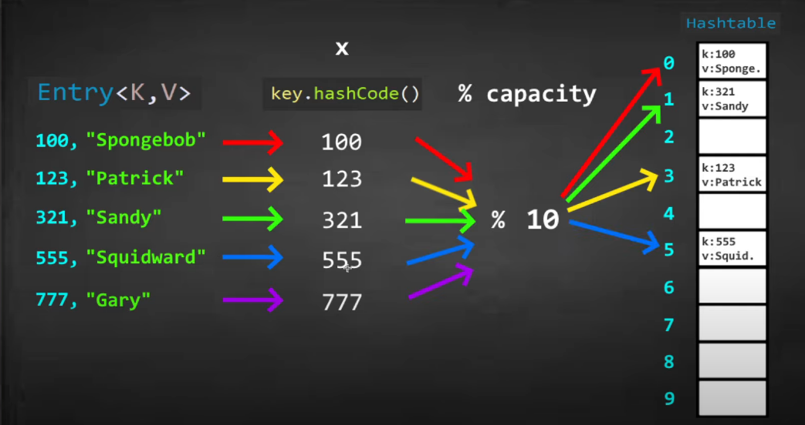
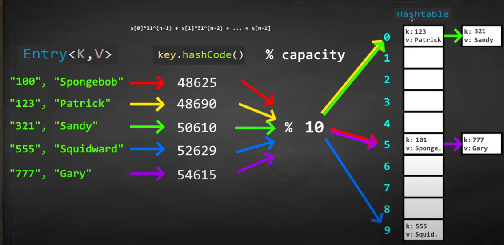

# 🧠 Deep Dive into HashTables in Java

## ✅ What is a Hashtable?
A **Hashtable** in Java is a part of the `java.util` package that maps **keys to values**. It **does not allow null keys or null values**, and each key must be **unique**.

```java
Hashtable<Key, Value> table = new Hashtable<>();
```

---

## 🚀 Key Concepts

### 🔐 Key-Value Pair (Entry)
Each element in a hashtable is a key-value pair, also known as an **Entry**. The key is used to retrieve its corresponding value.

### ⚙️ Hashing
Hashing is the process of converting a key into an integer (hash code), which is then used to calculate an **index**:
```java
index = key.hashCode() % capacity;
```
This index points to the **bucket** where the entry is stored.

### 📦 Buckets
A **bucket** is a storage location in the hashtable where key-value pairs are stored. Each bucket can store **one or more entries**.

### 🔁 Collisions
When two keys produce the same hash code (i.e., they map to the same bucket), this is called a **collision**. Java handles collisions using a technique like **chaining** (storing multiple entries in a bucket using a linked list).




---

## 📊 Performance
| Operation       | Average Time | Worst Time   |
|----------------|--------------|--------------|
| Insertion       | O(1)         | O(n) (collision-heavy) |
| Deletion        | O(1)         | O(n)         |
| Search (get)    | O(1)         | O(n)         |

> ⚠️ **Note**: Performance depends on how well the hash function distributes entries and the number of collisions.

---

## 🧪 Sample Code & Explanation
```java
Hashtable<Integer, String> table = new Hashtable<>();

table.put(100, "Spongebob");
table.put(123, "Patrick");
table.put(321, "Sandy");
table.put(555, "Squidward");
table.put(777, "Gary");

for(Integer key : table.keySet()) {
    System.out.println(key.hashCode() % 10 + "\t" + key + "\t" + table.get(key));
}
```

### 🧠 What This Does:
- Adds 5 key-value pairs to the hashtable.
- Iterates through all keys and prints:
    - Index (`key.hashCode() % 10`) → Shows where it would go in a hashtable of capacity 10.
    - Key
    - Value

### 📌 Sample Output:
```
0	100	Spongebob
3	123	Patrick
1	321	Sandy
5	555	Squidward
7	777	Gary
```

---

## ⚖️ Hashtable vs HashMap
| Feature          | Hashtable            | HashMap                |
|------------------|----------------------|-------------------------|
| Thread-safe      | ✅ Yes               | ❌ No (can be made synchronized) |
| Allows null keys | ❌ No                | ✅ One null key         |
| Allows null values | ❌ No              | ✅ Yes                 |
| Performance      | ❌ Slower (sync overhead) | ✅ Faster             |

---

## 🧠 Real-world Use Cases
- Storing user sessions (`<sessionId, userObject>`)
- Caching results (`<queryString, result>`)
- Phone directories (`<name, phoneNumber>`)

---

## ✅ Summary
- Hashtable stores key-value pairs using hashing.
- Very efficient for **searching**, **inserting**, and **deleting**.
- Doesn’t allow null keys or values.
- Thread-safe but slower than `HashMap`.
- Collision handling is done internally (typically via chaining).

> Use Hashtable when **thread safety is critical**, otherwise prefer **HashMap**.

Let me know if you'd like diagrams or collision resolution strategies explained too!

